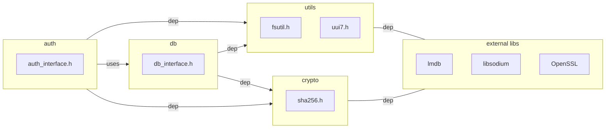
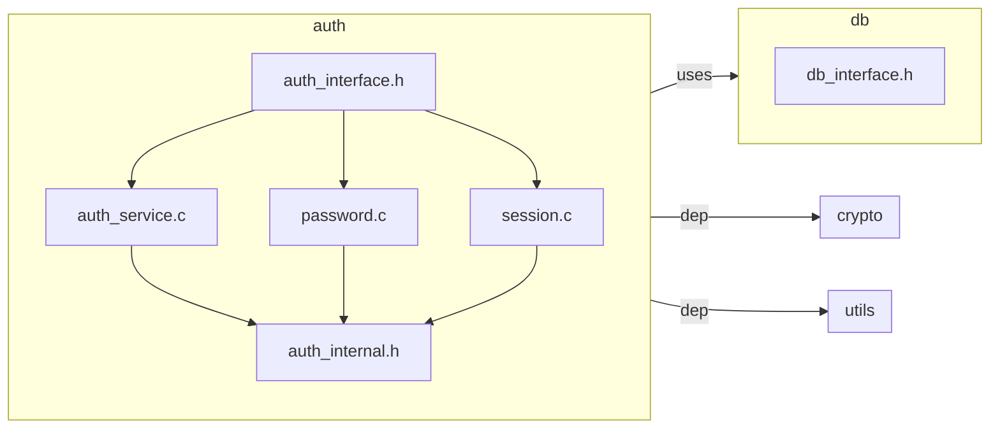
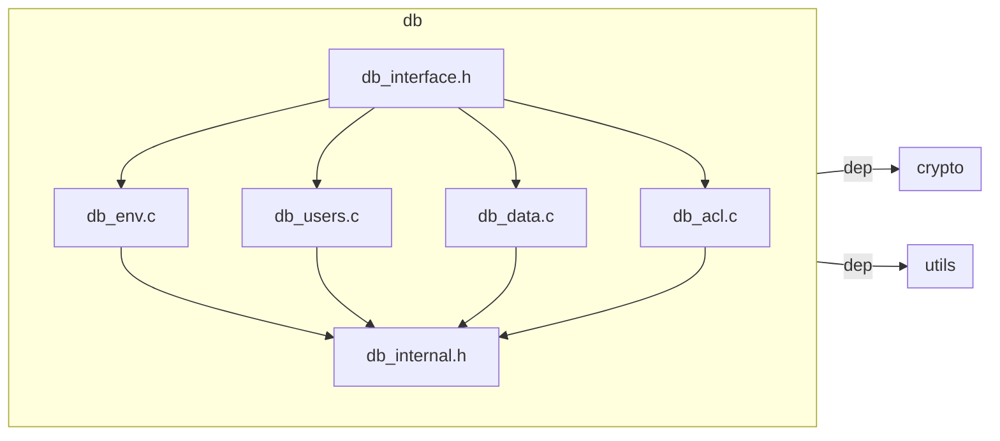
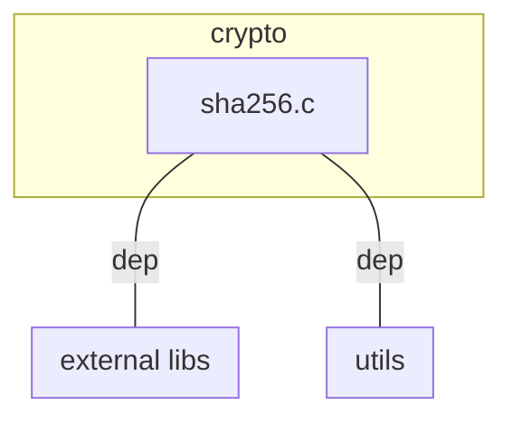
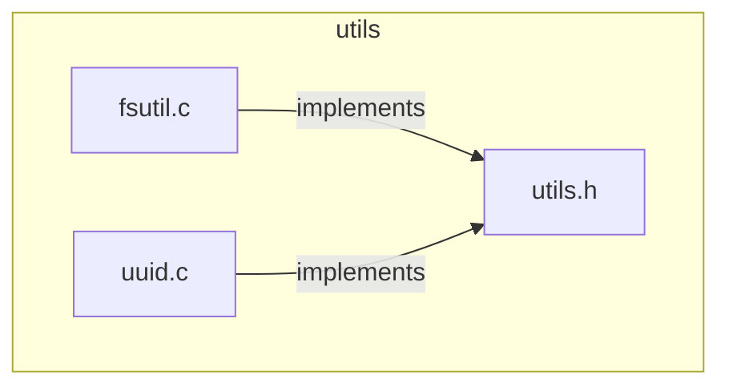
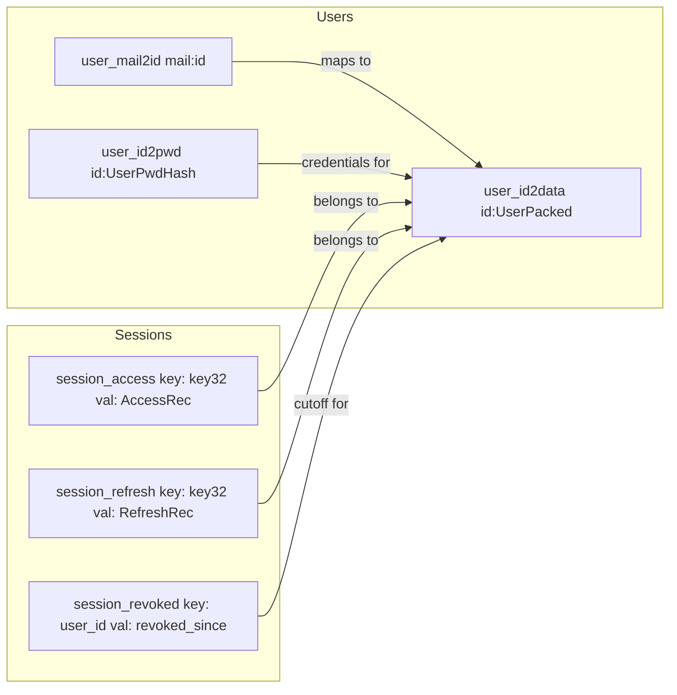
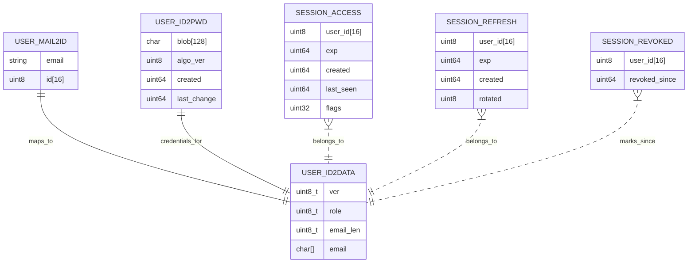

# Static Architecture — Auth + DB (v1)

This document captures the *static* structure of the project: modules, public APIs, dependencies, and where external libraries are used. Dynamic behavior (runtime flows) will come next.

---

## Overview

## Auth details

## DB details

## Crypto details

## Utils details

## Storage details

**Layering rule:** `main → (auth, db)`. Auth may call **db\_interface** only; DB never includes auth headers. Crypto helpers are leaf utilities.

---
